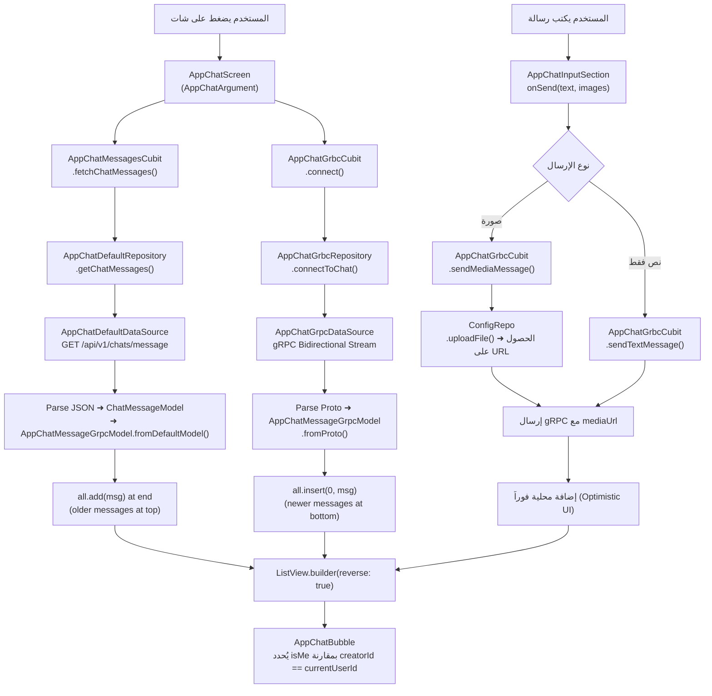

# 📱 Chat System Documentation — health.mobile (Afiti)

> **الغرض من هذا الملف:** توثيق شامل لنظام الشات الموجود في مشروع `health.mobile` بهدف إعادة بناؤه في تطبيق آخر.
> **المصدر:** `lib/core/chat/` داخل مشروع Afiti.

---

## 📋 جدول المحتويات

1. [نظرة عامة على النظام](#overview)
2. [البنية الكاملة للملفات](#folder-structure)
3. [طبقة البيانات — Data Layer](#data-layer)
   - [النماذج (Models)](#models)
   - [مصادر البيانات (DataSources)](#datasources)
   - [المستودعات (Repositories)](#repositories)
4. [gRPC — الاتصال اللحظي](#grpc)
   - [ملف Proto](#proto-file)
   - [تفاصيل الاتصال](#grpc-connection)
5. [طبقة الحالة — Cubits / State Management](#state-management)
6. [طبقة العرض — Presentation Layer](#presentation)
   - [شاشة قائمة الشاتات](#chats-list-screen)
   - [شاشة الشات الفردي](#chat-screen)
   - [الويدجتس](#widgets)
7. [API Endpoints](#api-endpoints)
8. [تدفق البيانات الكامل](#data-flow)
9. [الباكدجات المستخدمة](#packages)
10. [دليل الاستخدام لتطبيق جديد](#usage-guide)

---

## 🏗️ نظرة عامة على النظام {#overview}

نظام الشات في Afiti يعمل بـ **نظامين متكاملين في نفس الوقت**:

| النظام | الاستخدام | البروتوكول |
|--------|-----------|-----------|
| **REST API** | جلب قائمة الشاتات + الرسائل السابقة (pagination) | HTTP/Dio |
| **gRPC Streaming** | إرسال واستقبال الرسائل في الوقت الفعلي | gRPC over TLS/443 |

### كيف يعملان معاً؟

```
عند فتح شاشة الشات:
1. REST API ➜ يجلب الرسائل القديمة (History/Pagination)
2. gRPC Stream ➜ يفتح اتصال مباشر لاستقبال الرسائل الجديدة فوراً

عند إرسال رسالة:
1. يُضاف الـ message محلياً فوراً (Optimistic UI)
2. يُرسل عبر gRPC Stream
3. يصل للطرف الآخر عبر نفس الـ Stream
```

---

## 📁 البنية الكاملة للملفات {#folder-structure}

```
lib/core/chat/
├── cubit/
│   ├── app_chat_grbc/
│   │   ├── app_chat_grbc_cubit.dart       ← Cubit الاتصال الـ gRPC والإرسال
│   │   └── app_chat_grbc_state.dart       ← حالات الـ gRPC Cubit
│   └── app_default_chat_cubit/
│       ├── app_chat_messages_default_cubit.dart  ← Cubit جلب الرسائل (REST)
│       └── app_default_cubit.dart                ← Cubit قائمة الشاتات (REST)
│
├── data/
│   ├── datasources/
│   │   ├── app_chat_default_data_source.dart     ← REST API calls
│   │   ├── app_chat_grpc_data_source.dart        ← gRPC connection
│   │   └── grpc/
│   │       ├── Chat.proto                         ← تعريف الـ Proto
│   │       └── generated/                         ← الملفات المولّدة
│   │           ├── Chat.pb.dart
│   │           ├── Chat.pbenum.dart
│   │           └── Chat.pbgrpc.dart
│   ├── enums/
│   │   └── role_type_enum.dart                   ← أنواع الأدوار (Doctor, Patient, etc.)
│   ├── models/
│   │   ├── app_chat_message_model.dart           ← موديل الرسالة (shared بين gRPC و REST)
│   │   ├── app_message_type.dart                 ← أنواع الرسائل (text, image, video...)
│   │   ├── app_send_message_model.dart           ← موديل إرسال الرسالة عبر gRPC
│   │   ├── chat_message_model.dart               ← موديل الرسالة البسيط
│   │   ├── app_chat_default_models/
│   │   │   ├── app_get_all_chats_response_model.dart   ← API Response لقائمة الشاتات
│   │   │   ├── app_get_all_chats_result_model.dart     ← بيانات شات واحد
│   │   │   ├── app_last_message_model.dart             ← آخر رسالة في الشات
│   │   │   └── user.dart                               ← موديل المستخدم في الشات
│   │   └── app_chat_message_defauilt_model/
│   │       └── app_chat_messages_response_model.dart   ← API Response للرسائل
│   └── repos/
│       ├── app_chat_grbc_repository.dart         ← Repository للـ gRPC
│       └── app_chat_default_repository.dart      ← Repository للـ REST (abstract + impl)
│
└── presentation/
    └── screens/
        ├── app_chats_list_screen.dart            ← شاشة قائمة الشاتات
        ├── app_chat_screen.dart                  ← شاشة الشات الفردي
        └── widget/
            ├── app_chat_app_bar_section.dart     ← الـ AppBar مع بيانات المستخدم
            ├── app_chat_input_section.dart       ← حقل الإدخال + زر الإرسال + الصور
            ├── app_chat_message_section.dart     ← فقاعة الرسالة (Bubble)
            ├── app_chat_list_item.dart           ← عنصر في قائمة الشاتات
            └── custom_app_chat_icon.dart         ← أيقونة الشات
```

---

## 🗂️ طبقة البيانات {#data-layer}

### النماذج (Models) {#models}

#### 1. `AppMessageType` — أنواع الرسائل
```dart
enum AppMessageType {
  text,   // 0
  video,  // 1
  audio,  // 2
  image,  // 3
  file;   // 4

  static AppMessageType fromProtoValue(int value) { ... }
  int toProtoValue() => index;
}
```

#### 2. `AppChatMessageGrpcModel` — النموذج الموحد للرسالة
> **مهم جداً:** هذا الموديل يُستخدم لكلا المصدرين (gRPC والـ REST). يتم تحويل بيانات الـ REST إليه.

```dart
class AppChatMessageGrpcModel extends Equatable {
  final int chatId;         // ID الشات
  final int? id;            // ID الرسالة
  final int recipientId;    // ID المستقبل
  final int creatorId;      // ID المرسل
  final String? content;    // نص الرسالة
  final AppMessageType type; // نوع الرسالة
  final String? mediaUrl;   // رابط الوسائط (صورة/فيديو)
  final String createdOn;   // وقت الإنشاء (مُنسَّق كـ String)
  final bool isMe;          // هل الرسالة من المستخدم الحالي؟
  final bool isRead;        // هل تمت القراءة؟

  // من الـ gRPC Proto
  factory AppChatMessageGrpcModel.fromProto(pb.GrpcRrecipientMessage proto)

  // من الـ REST API
  static AppChatMessageGrpcModel fromDefaultModel(ChatMessageModel e)
}
```

#### 3. `AppSendMessageModel` — موديل إرسال الرسالة عبر gRPC
```dart
class AppSendMessageModel {
  final int recipientId;
  final String? message;     // نص الرسالة (optional)
  final AppMessageType type;
  final String? mediaUrl;    // رابط الوسائط بعد الرفع (optional)

  pb.GrpcSendMessageRequest toProto() { ... }
}
```

#### 4. `AppGetAllChatsResultModel` — بيانات شات في القائمة
```dart
class AppGetAllChatsResultModel {
  int? chatId;          // ID الشات
  int? participantId;   // ID المشارك
  int? creatorId;       // ID من أنشأ الشات
  int? profileId;       // ID البروفايل (للانتقال لصفحة الشخص)
  bool? ai;             // هل شات مع AI؟
  String? createdOn;    // تاريخ الإنشاء
  AppLastMessageModel? message;  // آخر رسالة
  User? user;           // بيانات المستخدم الآخر
}
```

#### 5. `User` — بيانات المستخدم في الشات
```dart
class User {
  int? id;
  String? name;
  String? phone;
  String? address;
  String? photoUrl;
  num? latitude;
  num? longitude;
  RoleTypeEnum? type;  // doctor / patient / hospital / pharmacy / laboratory
}
```

#### 6. `RoleTypeEnum` — أنواع الأدوار
```dart
enum RoleTypeEnum {
  admin,        // 0
  doctor,       // 1
  patient,      // 2
  hospital,     // 3
  pharmacy,     // 4
  laboratory;   // 5

  static RoleTypeEnum fromJson(int index) { ... }
}
```

---

### مصادر البيانات (DataSources) {#datasources}

#### `AppChatDefaultDataSource` — REST API Calls
```dart
abstract class AppChatDefaultDataSource {
  // جلب قائمة الشاتات مع Pagination
  Future<ResponseModel> appGetAlChats(int page, int? closedChatId);

  // جلب رسائل شات معين مع Pagination
  Future<ResponseModel> getChatMessages({
    int? chatId,
    int? userId,
    required int pageSize,    // افتراضي 20
    required int pageIndex,
    String? search,
  });
}
```

**الـ Implementation:**
```dart
@LazySingleton(as: AppChatDefaultDataSource)
class AppChatDefaultDataSourceImpl extends RemoteExecuteImpl {
  // GET /api/v1/chats
  // query params: pageIndex, pageSize, closedChatId (optional)
  Future<ResponseModel> appGetAlChats(...)

  // GET /api/v1/chats/message
  // query params: chatId/userId, pageIndex, pageSize, sortDirection=1, search (optional)
  Future<ResponseModel> getChatMessages(...)
}
```

#### `AppChatGrpcDataSource` — gRPC Connection
```dart
abstract class AppChatGrpcDataSource {
  Stream<pb.GrpcRrecipientMessage> connectToChat();  // فتح الاتصال
  Future<void> sendMessage(pb.GrpcSendMessageRequest message);  // إرسال
  Future<void> disconnect();  // قطع الاتصال
}

@Injectable(as: AppChatGrpcDataSource)
class AppChatGrpcDataSourceImpl implements AppChatGrpcDataSource {
  // Production: afiti-tech.runasp.net:443  (TLS)
  // Test: afiti-tech-test.runasp.net:443   (TLS)
  final String host = EndPoints.isProduction ? EndPoints.prodChatUrl : EndPoints.testChatUrl;
  final int port = 443;
  final bool useSecure = true;

  // الكيانات الداخلية
  ClientChannel? _channel;
  GrpcChatServiceClient? _eng;
  StreamController<pb.GrpcSendMessageRequest>? _requestController;
  ResponseStream<pb.GrpcRrecipientMessage>? _responseStream;
}
```

---

### المستودعات (Repositories) {#repositories}

#### `AppChatGrbcRepository` — gRPC Repository
```dart
@Injectable()
class AppChatGrbcRepository {
  final AppChatGrpcDataSource dataSource;

  // يفتح الـ Stream ويحوّل Proto messages إلى AppChatMessageGrpcModel
  Stream<AppChatMessageGrpcModel> connectToChat() async* { ... }

  // يبني AppSendMessageModel ويحوله إلى Proto ثم يرسله
  Future<void> sendMessage({
    required int recipientId,
    String? message,
    required AppMessageType type,
    String? mediaUrl,
  }) async { ... }

  Future<void> disconnect() async { ... }
}
```

#### `AppChatDefaultRepository` — REST Repository
```dart
abstract class AppChatDefaultRepository {
  Future<Either<Failure, ResponseModel>> appGetAlChats(int page, int? closedChatId);
  Future<Either<Failure, ResponseModel>> getChatMessages({...});
}

@LazySingleton(as: AppChatDefaultRepository)
class AppChatDefaultRepositoryImpl implements AppChatDefaultRepository { ... }
```

---

## ⚡ gRPC — الاتصال اللحظي {#grpc}

### ملف Proto {#proto-file}

```protobuf
package chat;

service GrpcChatService {
  // Bidirectional Streaming — نفس الـ stream للإرسال والاستقبال
  rpc SendMessage(stream GrpcSendMessageRequest) returns (stream GrpcRrecipientMessage);
}

// طلب الإرسال
message GrpcSendMessageRequest {
  required int64 RecipientId = 1;   // ID المستقبل
  optional string Message = 2;      // النص (اختياري إذا كانت وسائط)
  required GrpcMessageType Type = 3; // النوع
  optional string MediaUrl = 4;     // رابط الوسائط
}

// الرسالة المستقبلة
message GrpcRrecipientMessage {
  required int64 ChatId = 1;        // ID الشات
  required int64 RecipientId = 2;   // ID المستقبل
  required int64 CreatorId = 3;     // ID المرسل
  optional string Content = 4;      // النص
  required GrpcMessageType Type = 5;
  optional string MediaUrl = 6;
  required google.protobuf.Timestamp CreatedOn = 7;
}

enum GrpcMessageType {
  Text = 0;
  Video = 1;
  Audio = 2;
  Image = 3;
  File = 4;
}
```

### تفاصيل الاتصال {#grpc-connection}

```
🌐 Host:    afiti-tech.runasp.net (prod) / afiti-tech-test.runasp.net (test)
🔌 Port:    443
🔒 Security: TLS (ChannelCredentials.secure)
🔑 Auth:    Authorization: Bearer <JWT_TOKEN>  (في metadata)
♻️ KeepAlive: مفعّل (ClientKeepAliveOptions)
```

**الخطوات التفصيلية للاتصال:**

```dart
// 1. إنشاء الـ Channel
_channel = ClientChannel(
  host,
  port: 443,
  options: ChannelOptions(
    credentials: ChannelCredentials.secure(),
    keepAlive: ClientKeepAliveOptions(),
  ),
);

// 2. إنشاء الـ Client
_eng = GrpcChatServiceClient(_channel!);

// 3. إنشاء StreamController للإرسال
_requestController = StreamController<pb.GrpcSendMessageRequest>();

// 4. فتح الـ Bidirectional Stream مع Auth header
_responseStream = _eng!.sendMessage(
  _requestController!.stream,
  options: CallOptions(
    metadata: {'authorization': 'Bearer $token'},
  ),
);

// 5. الاستماع للرسائل الواردة
_responseStream!.listen(
  (message) => { /* معالجة الرسالة */ },
  onError: (error, stackTrace) => { /* معالجة الخطأ */ },
  onDone: () => { /* انتهى الـ stream */ },
);
```

---

## 🎯 طبقة الحالة (State Management) {#state-management}

### 1. `AppChatGrbcCubit` — مسؤول عن الـ gRPC

#### الحالات (States):
```dart
abstract class AppChatGrbcState extends Equatable {}

class ChatInitial extends AppChatGrbcState {}           // الحالة الأولية
class ChatConnecting extends AppChatGrbcState {}        // جاري الاتصال
class ChatConnected extends AppChatGrbcState {}         // متصل
class ChatSendingMessage extends AppChatGrbcState {}    // جاري الإرسال
class ChatMessageSent extends AppChatGrbcState {
  final String successMessage;                          // تم الإرسال
}
class ChatLoaded extends AppChatGrbcState {
  final List<AppChatMessageGrpcModel> messages;
  final int currentUserId;                              // رسائل جديدة وصلت
}
class ChatError extends AppChatGrbcState {
  final String message;                                 // خطأ
}
class ChatDisconnected extends AppChatGrbcState {}      // انقطع الاتصال
```

#### الدوال الرئيسية:
```dart
class AppChatGrbcCubit extends Cubit<AppChatGrbcState> {

  // 1. الاتصال (يُستدعى في initState)
  Future<void> connect() async {
    // استخراج userId من JWT Token
    currentUserId = int.parse(JwtDecoder.decode(token)['UserId']);
    emit(ChatConnecting());
    final stream = repository.connectToChat();
    // الاستماع وتصفية الرسائل
    _chatSubscription = stream.listen(
      (message) {
        if (message.recipientId == currentUserId || message.creatorId == currentUserId) {
          _addMessage(message);  // إضافة للقائمة والـ emit
        }
      },
    );
    emit(ChatConnected());
  }

  // 2. إرسال نص
  Future<void> sendTextMessage({required int recipientId, required String message}) async {
    // أضف الرسالة محلياً أولاً (Optimistic UI)
    _addMessage(AppChatMessageGrpcModel(isMe: true, ...));
    // أرسل للسيرفر
    await repository.sendMessage(recipientId: recipientId, message: message, type: AppMessageType.text);
  }

  // 3. إرسال وسائط (صور)
  Future<void> sendMediaMessage({
    required int recipientId,
    required AppMessageType type,
    String? caption,
    required List<File> images,
  }) async {
    // رفع الصور أولاً للـ storage
    final urls = await _uploadFiles(images);
    // إرسال كل صورة عبر gRPC
    for (final url in urls) {
      await repository.sendMessage(recipientId: recipientId, type: type, mediaUrl: url);
    }
  }

  // 4. قطع الاتصال (في dispose)
  Future<void> disconnect() async {
    await _chatSubscription?.cancel();
    await repository.disconnect();
    _messages.clear();
    emit(ChatDisconnected());
  }

  // 5. إعادة الاتصال
  Future<void> retry() async => connect();
}
```

### 2. `AppChatMessagesCubit` — جلب الرسائل القديمة (REST)

```dart
@Injectable()
class AppChatMessagesCubit extends Cubit<CubitStates> {

  Future<void> fetchChatMessages({
    int? chatId,      // إذا عندك chatId
    int? userId,      // أو userId إذا ما عندكش chatId بعد
    bool isRefresh = false,
    int pageSize = 20,
    String? search,
  }) async {
    // Pagination تلقائية
    // اجمع النتائج القديمة مع الجديدة
  }
}
```

### 3. `AppChatDefaultCubit` — قائمة الشاتات (REST)

```dart
@Injectable()
class AppChatDefaultCubit extends Cubit<CubitStates> {

  Future<void> appGetAllChats({
    bool isRefresh = false,
    int? closedChatId,  // لإغلاق شات معين
  }) async {
    // GET /api/v1/chats?pageIndex=1&pageSize=15
    // Infinite scroll pagination
  }
}
```

---

## 🖥️ طبقة العرض (Presentation) {#presentation}

### شاشة قائمة الشاتات {#chats-list-screen}

```dart
class AppChatsListScreen extends StatefulWidget {
  // يستخدم: AppChatDefaultCubit
  // يعرض: ListView من AppChatListItem
  // يدعم: Infinite Scroll + animation
}
```

**بيانات يحتاجها:**
- يُطلب `appGetAllChats()` عند التهيئة من خلال الـ Cubit الذي يُحقن في الـ Route.

### شاشة الشات الفردي {#chat-screen}

```dart
class AppChatScreen extends StatefulWidget {
  final AppChatArgument appChatArgument;
  // يستخدم: AppChatGrbcCubit + AppChatMessagesCubit + ImagesCubit
}

// البيانات المطلوبة لفتح الشات
class AppChatArgument {
  final int? chatId;          // ID الشات (nullable في أول مرة)
  final int recipientId;      // ID المستخدم الآخر (مطلوب)
  final RoleTypeEnum typeEnum; // نوع دور المستخدم الآخر
  final int profileId;        // ID بروفايل المستخدم الآخر
  final String recipientName; // اسم المستخدم الآخر
  final String recipientImage;// صورة المستخدم الآخر
}
```

**ما يحدث في `initState`:**
```dart
void initState() {
  // 1. جلب الرسائل القديمة من REST
  if (chatId != null) {
    context.read<AppChatMessagesCubit>().fetchChatMessages(chatId: chatId);
  } else {
    context.read<AppChatMessagesCubit>().fetchChatMessages(userId: recipientId);
  }

  // 2. الاتصال بـ gRPC لاستقبال الرسائل الجديدة
  context.read<AppChatGrbcCubit>().connect();

  // 3. مستمع للـ scroll لتحميل رسائل أقدم
  _scrollController.addListener(_onScroll);
}
```

**منطق دمج الرسائل:**
```dart
// القائمة الموحدة
final List<AppChatMessageGrpcModel> all = [];

// الرسائل القديمة (REST) ➜ تُضاف في النهاية (الأعلى عند reverse)
// الرسائل الجديدة (gRPC) ➜ تُضاف في البداية (الأسفل عند reverse)
// ListView.builder(reverse: true, ...)  ← عكس الاتجاه للشات
```

### الويدجتس {#widgets}

#### 1. `AppChatBubble` — فقاعة الرسالة
```dart
// يعرض:
// - صورة الأفاتار للمستخدم الآخر
// - الصورة/الوسائط إن وجدت (مع إمكانية فتح Full Screen)
// - النص
// - الوقت
// - علامة القراءة (done / done_all)
// - فرق بصري واضح بين رسالتي ورسالة الآخر (gradient vs flat)
```

#### 2. `AppChatInputSection` — حقل الإدخال
```dart
// يحتوي على:
// - زر اختيار الصور (ImagesCubit.pickImages)
// - TextField
// - زر الإرسال (مع AnimatedOpacity)
// - Preview للصور المختارة مع إمكانية الحذف
// - يستدعي: onSend(text, images)
```

#### 3. `AppChatAppBarSection` — الـ AppBar
```dart
// يعرض:
// - صورة المستخدم مع Hero animation
// - اسم المستخدم
// - زر الرجوع
// - عند الضغط: ينتقل لبروفايل المستخدم حسب RoleTypeEnum
```

#### 4. `AppChatListItem` — عنصر قائمة الشاتات
```dart
// يعرض:
// - صورة المستخدم مع Hero animation
// - اسم المستخدم
// - آخر رسالة
// - وقت آخر رسالة
// - تأثيرات hover + scale animation
// - عند الضغط: ينتقل لـ AppChatScreen
```

---

## 🔌 API Endpoints {#api-endpoints}

### Base URLs
```
Production:  https://afiti-tech.runasp.net
Test:        https://afiti-tech-test.runasp.net

gRPC (Prod): afiti-tech.runasp.net:443  (TLS)
gRPC (Test): afiti-tech-test.runasp.net:443 (TLS)
```

### REST Endpoints
| Method | Endpoint | الوصف | Query Params |
|--------|----------|-------|--------------|
| `GET` | `/api/v1/chats` | جلب قائمة الشاتات | `pageIndex`, `pageSize=15`, `closedChatId?` |
| `GET` | `/api/v1/chats/message` | جلب رسائل شات | `chatId?`, `userId?`, `pageIndex`, `pageSize=20`, `sortDirection=1`, `search?` |

### REST Response Structures

#### قائمة الشاتات `GET /api/v1/chats`
```json
{
  "success": true,
  "statusCode": 200,
  "message": "...",
  "pageSize": 15,
  "pageIndex": 1,
  "totalCount": 25,
  "totalPages": 2,
  "moveNext": true,
  "movePrevious": false,
  "result": [
    {
      "chatId": 101,
      "participantId": 5,
      "creatorId": 3,
      "profileId": 19,
      "ai": false,
      "createdOn": "2024-01-15T10:30:00Z",
      "message": {
        "id": 500,
        "chatId": 101,
        "recipientId": 3,
        "creatorId": 5,
        "content": "أهلاً، كيف حالك؟",
        "mediaUrl": null,
        "read": false,
        "messageType": 0,
        "readOn": null,
        "createdOn": "2024-01-15T10:30:00Z"
      },
      "user": {
        "id": 5,
        "name": "د. أحمد محمد",
        "phone": "+201001234567",
        "address": "القاهرة",
        "photoUrl": "path/to/photo.jpg",
        "latitude": 30.0444,
        "longitude": 31.2357,
        "type": 1
      }
    }
  ]
}
```

#### رسائل الشات `GET /api/v1/chats/message`
```json
{
  "success": true,
  "statusCode": 200,
  "message": "...",
  "pageSize": 20,
  "pageIndex": 1,
  "totalCount": 80,
  "totalPages": 4,
  "result": [
    {
      "id": 500,
      "chatId": 101,
      "recipientId": 3,
      "creatorId": 5,
      "content": "أهلاً، كيف حالك؟",
      "mediaUrl": null,
      "read": false,
      "messageType": 0,
      "readOn": null,
      "createdOn": "2024-01-15T10:30:00Z"
    }
  ]
}
```

### Authentication
جميع الطلبات تحتاج Header:
```
Authorization: Bearer <JWT_TOKEN>
Accept-Language: ar | en | tr
```

---

## 🔄 تدفق البيانات الكامل {#data-flow}



---

## 📦 الباكدجات المستخدمة {#packages}

```yaml
dependencies:
  # gRPC
  grpc: ^4.0.0           # الـ gRPC client
  protobuf: ^3.1.0       # Protobuf serialization
  fixnum: ^1.1.0         # Int64 للأرقام الكبيرة في Protobuf

  # State Management
  flutter_bloc: ^8.x.x   # BLoC/Cubit
  equatable: ^2.x.x      # مقارنة الحالات

  # Auth
  jwt_decoder: ^2.x.x    # استخراج userId من JWT Token

  # HTTP (للـ REST API)
  dio: ^5.9.0

  # DI
  injectable: ^2.x.x
  get_it: ^7.x.x

  # Images
  image_picker: ^x.x.x   # اختيار الصور
  photo_view: ^x.x.x     # عرض الصور بشكل Full Screen

  # UI
  flutter_screenutil: ^5.x.x
  cached_network_image: ^x.x.x
```

---

## 📖 دليل الاستخدام لتطبيق جديد {#usage-guide}

### الخطوة 1: إعداد الـ gRPC

1. **نسخ ملف Proto:**
```proto
// Chat.proto
syntax = "proto3";
package chat;
import "google/protobuf/timestamp.proto";

service GrpcChatService {
  rpc SendMessage(stream GrpcSendMessageRequest) returns (stream GrpcRrecipientMessage);
}

message GrpcSendMessageRequest {
  int64 RecipientId = 1;
  string Message = 2;
  GrpcMessageType Type = 3;
  string MediaUrl = 4;
}

message GrpcRrecipientMessage {
  int64 ChatId = 1;
  int64 RecipientId = 2;
  int64 CreatorId = 3;
  string Content = 4;
  GrpcMessageType Type = 5;
  string MediaUrl = 6;
  google.protobuf.Timestamp CreatedOn = 7;
}

enum GrpcMessageType {
  Text = 0;
  Video = 1;
  Audio = 2;
  Image = 3;
  File = 4;
}
```

2. **توليد الكود:**
```bash
# تثبيت protoc
# ثم:
protoc --dart_out=grpc:lib/core/chat/data/datasources/grpc/generated \
  -I lib/core/chat/data/datasources/grpc \
  lib/core/chat/data/datasources/grpc/Chat.proto
```

### الخطوة 2: تهيئة الـ Connection

```dart
// استبدل القيم:
const String host = 'YOUR_SERVER_HOST';  // مثال: api.yourapp.com
const int port = 443;
const bool useSecure = true;             // أو false للـ development

// الـ Token يجب أن يكون JWT يحتوي على UserId في الـ payload
```

### الخطوة 3: تسجيل الـ Cubits في الـ Route

```dart
// في الـ onGenerateRoute
case 'chatScreen':
  return MaterialPageRoute(
    builder: (_) => MultiBlocProvider(
      providers: [
        BlocProvider(create: (_) => getIt<AppChatGrbcCubit>()),
        BlocProvider(create: (_) => getIt<AppChatMessagesCubit>()),
        BlocProvider(create: (_) => getIt<AppChatDefaultCubit>()),
      ],
      child: AppChatScreen(appChatArgument: args),
    ),
  );
```

### الخطوة 4: الانتقال لشاشة الشات

```dart
Navigator.pushNamed(
  context,
  'chatScreen',
  arguments: AppChatArgument(
    chatId: 101,               // أو null إذا لم يُنشأ الشات بعد
    recipientId: 5,            // ID المستخدم الآخر (مطلوب دائماً)
    recipientName: 'د. أحمد',
    recipientImage: 'https://...',
    typeEnum: RoleTypeEnum.doctor,
    profileId: 19,
  ),
);
```

### الخطوة 5: رفع الصور (Media Messages)

رفع الصور يتم عبر مستودع منفصل `ConfigRepo.uploadFile()` ثم إرسال الـ URL عبر gRPC:
```dart
// نمط الـ URL للصور المرفوعة:
'${AppConstants.streamUrl}/$mediaUrl'
// مثال: https://files.yourapp.com/path/to/photo.jpg
```

---

## ⚠️ ملاحظات مهمة

> [!IMPORTANT]
> **Bidirectional Stream:** نفس الـ stream يُستخدم للإرسال والاستقبال معاً. `_requestController.add()` للإرسال، والـ `_responseStream.listen()` للاستقبال.

> [!WARNING]
> **قطع الاتصال:** يجب استدعاء `disconnect()` عند الخروج من الشاشة (`dispose` أو `close` في الـ Cubit) وإلا سيبقى الـ gRPC channel مفتوحاً.

> [!NOTE]
> **Optimistic UI:** الرسالة تُضاف محلياً فوراً قبل وصول تأكيد السيرفر لتجربة مستخدم أفضل.

> [!TIP]
> **تحديد المرسل:** يتم تحديد هل الرسالة "مني" بمقارنة `message.creatorId == currentUserId` (المستخرج من JWT Token).

> [!CAUTION]
> **sortDirection=1:** عند جلب الرسائل من REST API، يجب إرسال `sortDirection: 1` للحصول على الرسائل مرتبة من الأحدث للأقدم (للـ pagination الصحيح مع `reverse: true`).

---

## 🗝️ ملخص المفاتيح

| المفتاح | القيمة |
|---------|-------|
| JWT Claim للـ UserId | `UserId` |
| gRPC Auth Header | `authorization: Bearer <token>` |
| pageSize للشاتات | `15` |
| pageSize للرسائل | `20` |
| sortDirection | `1` (أحدث أولاً) |
| اتجاه ListView | `reverse: true` |
| الرسائل الجديدة | `all.insert(0, msg)` |
| الرسائل القديمة | `all.add(msg)` |

