# 🔔 Notifications System Documentation — health.mobile (Afiti)

> **الغرض من هذا الملف:** توثيق شامل لنظام الإشعارات (Notifications) الموجود في مشروع `health.mobile` بهدف إعادة بناؤه في تطبيق آخر.
> **المصدر:** `lib/core/utils/notification_helper/` + `lib/features/notifications/` داخل مشروع Afiti.

---

## 📋 جدول المحتويات

1. [نظرة عامة على النظام](#overview)
2. [البنية الكاملة للملفات](#folder-structure)
3. [طبقة البنية التحتية — Core Layer](#core-layer)
   - [Firebase Bootstrap](#firebase-bootstrap)
   - [PushNotificationFacade](#facade)
   - [LocalPushNotifications](#local-push)
   - [DeviceTokenSync](#device-token)
   - [FCM Background Handler](#background-handler)
   - [Notification Navigation](#navigation)
4. [طبقة البيانات — Data Layer](#data-layer)
   - [النماذج (Models)](#models)
   - [مصدر البيانات](#datasource)
   - [المستودع (Repository)](#repository)
5. [Domain Layer](#domain-layer)
6. [طبقة العرض — Presentation](#presentation)
7. [API Endpoints](#api-endpoints)
8. [تدفق البيانات الكامل](#data-flow)
9. [إعداد main.dart](#main-setup)
10. [الباكدجات المستخدمة](#packages)
11. [دليل الاستخدام لتطبيق جديد](#usage-guide)

---

## 🏗️ نظرة عامة على النظام {#overview}

نظام الإشعارات في Afiti يعمل بـ **طريقتين متكاملتين**:

| النظام | الاستخدام |
|--------|-----------|
| **Firebase FCM** | استقبال الـ Push Notifications من السيرفر لحظياً |
| **REST API** | جلب قائمة الإشعارات وعددها غير المقروء |

### حالات تشغيل التطبيق الثلاث

```
📱 Foreground (التطبيق مفتوح):
   Firebase ➜ onMessage ➜ LocalPushNotifications.showForeground() ➜ تظهر كـ local notification

🔄 Background (التطبيق في الخلفية):
   FCM ➜ Notification Tray (OS handles automatically) ➜ عند الضغط ➜ onMessageOpenedApp ➜ openNotificationScreen()

💀 Terminated (التطبيق مغلق):
   FCM ➜ OS Tray ➜ عند فتح التطبيق ➜ getInitialMessage() ➜ openNotificationScreen()
   Local ➜ getLaunchDetails() ➜ openNotificationScreen()

🌑 Background (data-only, بدون notification):
   firebaseMessagingBackgroundHandler ➜ LocalPushNotifications.showFromBackground()
```

---

## 📁 البنية الكاملة للملفات {#folder-structure}

```
lib/
│
├── core/utils/notification_helper/          ← 🔧 البنية التحتية
│   ├── notifications.dart                   ← Barrel export لكل الملفات
│   ├── firebase_bootstrap.dart             ← تهيئة Firebase (مرة واحدة)
│   ├── push_notification_facade.dart       ← الواجهة الرئيسية (Singleton Facade)
│   ├── local_push_notifications.dart       ← عرض الإشعارات المحلية
│   ├── device_token_sync.dart              ← إدارة FCM Token
│   ├── fcm_background_handler.dart         ← معالج الـ Background messages
│   ├── notification_navigation.dart        ← التنقل لشاشة الإشعارات عند الضغط
│   └── awesome_push_notifications.dart     ← ⚠️ مهجور (deprecated)
│
└── features/notifications/                  ← 🎯 Feature Layer (Clean Architecture)
    ├── data/
    │   ├── data_source/
    │   │   └── remote_data_source.dart     ← REST API calls
    │   └── model/
    │       ├── notification_model.dart     ← جميع النماذج
    │       └── notifecations_filter_model.dart ← فلتر القائمة
    ├── domain/
    │   ├── repo/
    │   │   └── notification_repo.dart      ← Repository (abstract + impl)
    │   └── use_cases/
    │       └── notification_use_case.dart  ← Use Cases
    └── presentation/
        ├── managers/
        │   └── notification_cubit.dart     ← Cubit
        ├── screens/
        │   └── notification_screen.dart   ← شاشة الإشعارات
        └── widgets/
            └── notification_row.dart      ← عنصر الإشعار
```

---

## 🔧 طبقة البنية التحتية — Core Layer {#core-layer}

### 1. Firebase Bootstrap {#firebase-bootstrap}

**الملف:** `firebase_bootstrap.dart`

```dart
/// تُستدعى مرة واحدة في main() قبل أي شيء آخر
Future<void> firebaseBootstrapInit() async {
  // تحقق أن Firebase لم يُهيَّأ مسبقاً (يمنع double init)
  if (Firebase.apps.isNotEmpty) return;

  await Firebase.initializeApp(
    options: DefaultFirebaseOptions.currentPlatform,
  );
}
```

> **⚠️ مهم:** تُستدعى قبل `configureDependencies()` وقبل `PushNotificationFacade.init()`.

---

### 2. PushNotificationFacade — الواجهة الرئيسية {#facade}

**الملف:** `push_notification_facade.dart`
**النمط:** Singleton

```dart
class PushNotificationFacade {
  static PushNotificationFacade? _instance;

  // ✅ نقطة الدخول الوحيدة — تُستدعى في main()
  static Future<void> init({required DeviceTokenSync deviceTokenSync}) async {
    await firebaseBootstrapInit();
    // ربط الـ Background handler (يجب قبل runApp)
    FirebaseMessaging.onBackgroundMessage(firebaseMessagingBackgroundHandler);
    _instance = PushNotificationFacade._(deviceTokenSync: deviceTokenSync);
    // إعداد الـ Messaging بعد أول frame (لأنه يحتاج BuildContext)
    WidgetsBinding.instance.addPostFrameCallback((_) {
      _instance!._configureMessaging();
    });
  }

  Future<void> _configureMessaging() async {
    // 1. طلب إذن Android 13+
    if (Platform.isAndroid) {
      await Permission.notification.request();
    }
    // 2. طلب إذن iOS
    await FirebaseMessaging.instance.requestPermission(alert: true, badge: true, sound: true);

    // 3. تهيئة الـ local notifications
    await LocalPushNotifications.init();
    await LocalPushNotifications.requestPermission();

    // 4. الاستماع للـ foreground messages
    FirebaseMessaging.onMessage.listen(_onForeground);

    // 5. الاستماع لضغط على الإشعار وهو في الخلفية
    FirebaseMessaging.onMessageOpenedApp.listen(_onOpened);

    // 6. التحقق إذا التطبيق فُتح من إشعار FCM (terminated state)
    final initial = await FirebaseMessaging.instance.getInitialMessage();
    if (initial != null) openNotificationScreen();

    // 7. التحقق إذا التطبيق فُتح من إشعار محلي (terminated state)
    final launchDetails = await LocalPushNotifications.getLaunchDetails();
    if (launchDetails?.didNotificationLaunchApp ?? false) openNotificationScreen();
  }

  // Foreground: عرض إشعار محلي
  Future<void> _onForeground(RemoteMessage message) async {
    await LocalPushNotifications.showForeground(message);
  }

  // Background tap: فتح شاشة الإشعارات
  void _onOpened(RemoteMessage message) {
    openNotificationScreen();
  }

  // تسجيل الـ FCM Token بعد تسجيل الدخول
  Future<bool> registerDeviceTokenWithBackend({String? token}) async {
    return _deviceTokenSync.registerIfAuthenticated(token: token);
  }
}
```

---

### 3. LocalPushNotifications — عرض الإشعارات المحلية {#local-push}

**الملف:** `local_push_notifications.dart`
**المكتبة:** `flutter_local_notifications`

```dart
class LocalPushNotifications {
  // Channel Settings
  static const String channelId   = 'high_importance_channel';
  static const String channelName = 'Health App Notifications';
  static const String channelDesc = 'Important health notifications';

  // تهيئة الـ plugin (مرة واحدة)
  static Future<void> init() async {
    // Android: @mipmap/ic_launcher كـ app icon
    const AndroidInitializationSettings initAndroid =
        AndroidInitializationSettings('@mipmap/ic_launcher');

    // iOS: الأذونات تُطلب يدوياً لاحقاً
    const DarwinInitializationSettings initIOS = DarwinInitializationSettings(
      requestAlertPermission: false,
      requestBadgePermission: false,
      requestSoundPermission: false,
    );

    await _notificationsPlugin.initialize(
      InitializationSettings(android: initAndroid, iOS: initIOS),
      onDidReceiveNotificationResponse: (response) {
        // عند ضغط المستخدم على الإشعار المحلي
        openNotificationScreen();
      },
    );
  }

  // إنشاء Notification Channel (Android) + طلب الأذونات (iOS)
  static Future<void> requestPermission() async {
    if (Platform.isAndroid) {
      await _createAndroidChannel();   // Importance.max + sound + vibration
    } else if (Platform.isIOS) {
      await _requestIOSPermissions();  // alert, badge, sound
    }
  }

  // عرض إشعار Foreground (مع دعم الصور)
  static Future<void> showForeground(RemoteMessage message) async {
    // ⬇️ يستخرج الصورة من notification.android.imageUrl أو data['image']
    // ⬇️ يحمّل الصورة ويحفظها محلياً لعرضها كـ BigPicture
    await _show(message);
  }

  // عرض إشعار من الـ background isolate (data-only messages)
  static Future<void> showFromBackground(RemoteMessage message) async {
    await init();  // إعادة init لأن الـ isolate جديد
    await _show(message);
  }
}
```

**آلية عرض الصورة في الإشعار:**
```dart
// إذا وجدت صورة:
// 1. تُحمَّل من URL باستخدام http.get()
// 2. تُحفظ في getApplicationDocumentsDirectory()
// 3. تُعرض كـ BigPicture (Android BigPictureStyleInformation)
// 4. تُعرض كـ largeIcon في نفس الوقت

final androidDetails = AndroidNotificationDetails(
  channelId, channelName,
  importance: Importance.max,
  priority: Priority.high,
  color: AppColors.primaryTeal,           // لون الـ icon
  largeIcon: FilePathAndroidBitmap(largeIconPath),
  styleInformation: BigPictureStyleInformation(
    FilePathAndroidBitmap(bigPicturePath),
    largeIcon: FilePathAndroidBitmap(largeIconPath),
    contentTitle: title,
    summaryText: body,
  ),
);
```

---

### 4. DeviceTokenSync — إدارة FCM Token {#device-token}

**الملف:** `device_token_sync.dart`

```dart
class DeviceTokenSync {
  final NotificationUseCase _notificationUseCase;

  // تحقق إذا المستخدم مسجّل دخول (وليس Guest)
  bool get isAuthenticated =>
    CacheHelper.token != null &&
    CacheHelper.token!.isNotEmpty &&
    !GuestHelper.isGuest;

  // الحصول على FCM Token (مع انتظار APNS على iOS)
  Future<String?> getFcmToken() async {
    if (Platform.isIOS) {
      // iOS: ينتظر حتى 10 ثوانٍ لـ APNS Token أولاً
      for (int i = 0; i < 10; i++) {
        final apnsToken = await FirebaseMessaging.instance.getAPNSToken();
        if (apnsToken != null) break;
        await Future.delayed(const Duration(seconds: 1));
      }
    }
    return await FirebaseMessaging.instance.getToken();
  }

  // تسجيل الـ token بعد تسجيل الدخول
  Future<bool> registerIfAuthenticated({String? token}) async {
    if (!isAuthenticated) return false;
    final registered = await registerWithBackend(token: token);
    await startListeningRefresh();   // مستمع لتجديد الـ token
    return registered;
  }

  // إرسال الـ token للـ API (مع 3 محاولات retry)
  Future<bool> registerWithBackend({String? token}) async {
    final fcmToken = token ?? await getFcmToken();
    if (fcmToken == null) return false;

    for (int attempt = 0; attempt < 3; attempt++) {
      final result = await _notificationUseCase.addFcmToken(token: fcmToken);
      final success = result.fold((_) => false, (_) => true);
      if (success) return true;
      // Exponential backoff: 1s, 2s
      if (attempt < 2) await Future.delayed(Duration(seconds: 1 << attempt));
    }
    return false;
  }

  // مستمع لتجديد الـ token تلقائياً عند تغييره
  Future<void> startListeningRefresh() async {
    _refreshSub = FirebaseMessaging.instance.onTokenRefresh.listen(
      (token) => registerIfAuthenticated(token: token),
    );
  }
}
```

---

### 5. FCM Background Handler {#background-handler}

**الملف:** `fcm_background_handler.dart`

```dart
// ⚠️ يجب أن يكون Top-level function (ليس method في class)
// ⚠️ يجب @pragma('vm:entry-point') لمنع الـ tree-shaking
@pragma('vm:entry-point')
Future<void> firebaseMessagingBackgroundHandler(RemoteMessage message) async {
  // أعِد تهيئة Firebase (الـ isolate جديد)
  await firebaseBootstrapInit();

  // إذا كان فيه notification: النظام سيعرضها تلقائياً في الـ tray
  if (message.notification != null) return;

  // إذا كان data-only message: نعرض إشعاراً محلياً
  await LocalPushNotifications.showFromBackground(message);
}
```

---

### 6. Notification Navigation {#navigation}

**الملف:** `notification_navigation.dart`

```dart
/// يفتح شاشة الإشعارات من أي مكان في التطبيق
void openNotificationScreen() {
  void navigate() {
    final navigator = navigatorKey.currentState;
    if (navigator == null) return;

    // لا يفتح لو المستخدم فعلاً على شاشة الإشعارات
    final currentRoute = ModalRoute.of(navigator.context)?.settings.name;
    if (currentRoute == AppRoutesKeys.notificationScreen) return;

    navigator.pushNamed(AppRoutesKeys.notificationScreen);
  }

  if (navigatorKey.currentState != null) {
    navigate();
  } else {
    // لو Navigator لم يُبنَ بعد (terminated state)
    WidgetsBinding.instance.addPostFrameCallback((_) => navigate());
  }
}
```

> **ملاحظة:** يستخدم `navigatorKey` وهو `GlobalKey<NavigatorState>` معرَّف في `HealthApp` (الـ MaterialApp) ويُمرَّر لها.

---

## 🗂️ طبقة البيانات — Data Layer {#data-layer}

### النماذج (Models) {#models}

#### 1. `NotificationDataModel` — بيانات إشعار واحد

```dart
class NotificationDataModel {
  int? id;               // ID الإشعار
  int? entityId;         // ID الكيان المرتبط (حجز، طلب، رسالة...)
  int? entityType;       // نوع الكيان (انظر جدول entityType أدناه)
  String? content;       // نص الإشعار (fallback)
  LocalizedMessage? creatorMessage;    // رسالة المرسل بـ ar/en
  LocalizedMessage? recipientMessage;  // رسالة المستقبل بـ ar/en ← الأهم
  int? opType;           // نوع العملية
  NotificationDetails? details;  // تفاصيل إضافية (JSON strings)
  int? creatorId;        // ID من أرسل الإشعار
  bool? read;            // هل تمت القراءة؟
  String? readOn;        // وقت القراءة
  String? createdOn;     // وقت الإنشاء (UTC String)
  NotificationCreator? creator;  // بيانات المرسل
}
```

#### جدول `entityType`
| القيمة | الوصف |
|--------|-------|
| `1` | حجز جلسة جديدة (Booking/Appointment) |
| `2` | تحديث طلب (Order Update) |
| `3` | رسالة جديدة (New Message) |

#### 2. `LocalizedMessage` — رسالة متعددة اللغات

```dart
class LocalizedMessage {
  String? ar;   // النص بالعربية
  String? en;   // النص بالإنجليزية

  factory LocalizedMessage.fromJson(Map<String, dynamic> json) =>
    LocalizedMessage(ar: json['ar'], en: json['en']);
}
```

**منطق اختيار اللغة في UI:**
```dart
String _getNotificationBody(BuildContext context) {
  final isArabic = Localizations.localeOf(context).languageCode == 'ar';

  // الأولوية: recipientMessage ➜ content
  String? body = isArabic
    ? item.recipientMessage?.ar ?? item.recipientMessage?.en
    : item.recipientMessage?.en ?? item.recipientMessage?.ar;

  return body ?? item.content ?? '';
}
```

#### 3. `NotificationCreator` — بيانات منشئ الإشعار

```dart
class NotificationCreator {
  int? id;
  String? name;
  int? type;         // نوع الدور (0=admin, 1=doctor, ...)
  String? address;
  String? photoUrl;  // للعرض في الـ NotificationRow
  String? phone;
  double? latitude;
  double? longitude;
}
```

#### 4. `NotificationDetails` — تفاصيل إضافية

```dart
class NotificationDetails {
  String? jsonValue;      // بيانات JSON كـ String
  String? oldJsonValue;   // القيمة القديمة (للتغييرات)
  String? newJsonValue;   // القيمة الجديدة (للتغييرات)
}

// بيانات داخل jsonValue (JsonValue model):
class JsonValue {
  String? day;
  int? status;
  int? dayOfWeek;
  int? userId;
  int? sessionId;
  int? patientId;
  int? paymentId;
  String? createdOn;
  String? updatedOn;
  int? creatorId;
  int? id;
}
```

#### 5. `UnreadNotificationsCountResponseModel` — عدد الغير مقروء

```dart
class UnreadNotificationsCountResponseModel extends ResponseModel {
  int get unreadCount => result is int ? result as int : 0;
  bool get hasUnread => unreadCount > 0;
}
```

#### 6. `NotifecationsFilterModel` — فلتر القائمة

```dart
class NotifecationsFilterModel extends FilterAbstract {
  String? userType;  // نوع المستخدم (doctor, patient, hospital...)

  // يُرسَل مع كل request
  @override
  toJson() => {
    'pageIndex': page,
    if (userType != null) 'status': userType,
  };
}
```

---

### مصدر البيانات {#datasource}

```dart
abstract class NotificationRemoteDataSource extends BaseListRemoteDataSource {
  Future<ResponseModel> getNotificationUnread({required String userType});
  Future<ResponseModel> addFcmToken({required String token});
}

@LazySingleton(as: NotificationRemoteDataSource)
class NotificationRemoteDataSourceImpl extends RemoteExecuteImpl {

  // GET /api/v1/{userType}/notifications?pageIndex=1
  @override
  Future<ResponseModel> getList({int? id, query}) {
    final userType = _normalizeUserType(query?.userType);
    return getData(
      endPoint: EndPoints.notificationList(userType),
      getFromJsonFunction: NotificationResponseModel.fromJson,
    );
  }

  // GET /api/v1/{userType}/notifications/unread
  @override
  Future<ResponseModel> getNotificationUnread({required String userType}) {
    return getData(
      endPoint: EndPoints.notificationUnread(_normalizeUserType(userType)),
      getFromJsonFunction: UnreadNotificationsCountResponseModel.fromJson,
    );
  }

  // POST /api/v1/user/fcm
  @override
  Future<ResponseModel> addFcmToken({required String token}) => addData(
    endPoint: EndPoints.addFcmToken,
    getFromJsonFunction: ResponseModel.fromJson,
    data: {"token": token},
  );

  // ✅ تنظيف الـ userType (case-insensitive + إصلاح typos)
  String _normalizeUserType(String? userType) {
    var type = userType ?? CacheHelper.userType ?? 'doctor';
    if (type == 'Hospitle') type = 'hospital';  // إصلاح typo قديم
    return type.toLowerCase();
  }
}
```

---

### المستودع (Repository) {#repository}

```dart
abstract class NotificationRepo extends ListRepo {
  Future<Either<Failure, ResponseModel>> getNotificationUnread({int? id, query});
  Future<Either<Failure, ResponseModel>> addFcmToken({required String token});
}

@LazySingleton(as: NotificationRepo)
class NotificationRepoImpl extends NotificationRepo {

  // Guard: لا تستدعي API إذا المستخدم مش مسجّل دخول أو Guest
  bool _canUseNotifications(String? userType) =>
    CacheHelper.hasActiveUserSession &&
    userType != null &&
    userType.isNotEmpty &&
    userType != 'Guest';

  @override
  Future<Either<Failure, ResponseModel>> getList({int? id, query}) {
    final userType = query?.userType ?? CacheHelper.userType;
    // ✅ إذا Guest أو غير مسجل: أرجع قائمة فارغة بدون API call
    if (!_canUseNotifications(userType)) return Future.value(_emptyResponse([]));
    return executeImpl(() => remoteDataSource.getList(id: id, query: query));
  }

  @override
  Future<Either<Failure, ResponseModel>> getNotificationUnread({int? id, query}) {
    final userType = query?.userType ?? CacheHelper.userType;
    // ✅ إذا Guest: أرجع 0 بدون API call
    if (!_canUseNotifications(userType)) return Future.value(_emptyResponse(0));
    return executeImpl(() => remoteDataSource.getNotificationUnread(userType: userType));
  }
}
```

---

## 🎯 Domain Layer {#domain-layer}

### NotificationUseCase

```dart
@lazySingleton
class NotificationUseCase extends ListUseCases {
  final NotificationRepo notificationRepo;

  NotificationUseCase({required this.notificationRepo})
    : super(listRepo: notificationRepo);

  // إضافة FCM Token
  Future<Either<Failure, ResponseModel>> addFcmToken({required String token}) =>
    notificationRepo.addFcmToken(token: token);

  // جلب عدد الإشعارات غير المقروءة
  Future<Either<Failure, ResponseModel>> getNotificationUnread({int? id, query}) =>
    notificationRepo.getNotificationUnread(id: id, query: query);

  // جلب قائمة الإشعارات (موروثة من ListUseCases)
  // Future<Either<Failure, ResponseModel>> getList({int? id, query}) => ...
}
```

---

## 🖥️ طبقة العرض (Presentation) {#presentation}

### NotificationCubit

```dart
@lazySingleton   // ← singleton لأن العدد غير المقروء يُحدَّث في كل مكان
class NotificationCubit
    extends CubitFilterListView<NotificationDataModel, NotifecationsFilterModel> {

  int unreadCount = 0;

  NotifecationsFilterModel notificationsFilterModel = NotifecationsFilterModel(
    userType: CacheHelper.userType,  // يُحدَّث تلقائياً من getFilter
  );

  // جلب قائمة الإشعارات (موروثة — تستدعي getList)
  // cubit.getList()

  // جلب عدد الإشعارات غير المقروءة
  Future<int?> getNotificationUnread() {
    if (!CacheHelper.hasActiveUserSession) {
      unreadCount = 0;
      safeEmit(LoadedState<int>(data: 0));
      return Future.value(0);
    }
    return managerExecute<int>(
      useCase.getNotificationUnread(),
      onSuccess: (data) {
        unreadCount = data ?? 0;
        safeEmit(LoadedState<int>(data: unreadCount));
      },
      onFail: (error) => safeEmit(FailedState(message: error)),
      onStart: () {},
    );
  }

  // Filter: يُرسَل مع كل request
  @override
  get getFilter {
    notificationsFilterModel.userType = CacheHelper.userType;  // تحديث دائم
    return notificationsFilterModel;
  }
}
```

### NotificationScreen

```dart
class NotificationScreen extends StatefulWidget {}

class _NotificationScreenState extends State<NotificationScreen> {
  late NotificationCubit _cubit;

  @override
  void initState() {
    _cubit = context.read<NotificationCubit>();
    _cubit.getList();   // جلب القائمة عند الفتح
  }

  @override
  Widget build(BuildContext context) {
    return Scaffold(
      appBar: CustomAppBar(
        title: "الإشعارات",
        onTrailingTap: () {
          // عند الرجوع: تحديث عداد الغير مقروء
          _cubit.getNotificationUnread();
          context.pop();
        },
      ),
      body: GenericListView<NotificationCubit, NotificationDataModel>(
        itemWidget: (index, items, item) => NotificationRow(item: item),
        separatorWidget: verticalSpace(12.h),
        shimmerWidget: (index) => LoadingButton(),
        emptyWidget: const EmptyWidget(message: "لا يوجد إشعارات حالياً"),
      ),
    );
  }
}
```

### NotificationRow — عنصر الإشعار

```dart
class NotificationRow extends StatelessWidget {
  // يعرض:
  // - صورة المرسل (creator.photoUrl) أو أيقونة Bell افتراضية
  // - العنوان: اسم المرسل أو عنوان حسب entityType
  // - نص الإشعار: recipientMessage (ar/en) أو content
  // - التاريخ: "الآن" / "منذ X دقيقة/ساعة/يوم" / "dd/MM/yyyy"
  // - مؤشر "جديد" (نقطة + نص) إذا read == false
  // - لون الخلفية: مختلف للمقروء وغير المقروء
}
```

**منطق تنسيق التاريخ:**
```dart
String _formatDate(String? dateString) {
  final date = DateTime.parse(dateString!).toLocal();
  final diff = DateTime.now().difference(date);

  if (diff.inDays == 0) {
    if (diff.inHours == 0) {
      if (diff.inMinutes == 0) return 'الآن';
      return 'منذ ${diff.inMinutes} دقيقة';
    }
    return 'منذ ${diff.inHours} ساعة';
  }
  if (diff.inDays == 1) return 'أمس';
  if (diff.inDays < 7) return 'منذ ${diff.inDays} يوم';
  return DateFormat('dd/MM/yyyy').format(date);
}
```

---

## 🔌 API Endpoints {#api-endpoints}

### Base URL
```
Production: https://afiti-tech.runasp.net
Test:       https://afiti-tech-test.runasp.net
```

### Endpoints

| Method | Endpoint | الوصف | Query Params |
|--------|----------|-------|--------------|
| `GET` | `/api/v1/{userType}/notifications` | جلب قائمة الإشعارات | `pageIndex` |
| `GET` | `/api/v1/{userType}/notifications/unread` | عدد الإشعارات غير المقروءة | — |
| `POST` | `/api/v1/user/fcm` | تسجيل FCM Device Token | — |

**قيم `{userType}`:** `doctor` / `patient` / `hospital` / `pharmacy` / `laboratory`

### Response: قائمة الإشعارات `GET /api/v1/{userType}/notifications`
```json
{
  "success": true,
  "statusCode": 200,
  "message": "...",
  "pageIndex": 1,
  "pageSize": 15,
  "totalCount": 30,
  "totalPages": 2,
  "result": [
    {
      "id": 201,
      "entityId": 55,
      "entityType": 1,
      "content": "لديك حجز جديد",
      "creatorMessage": { "ar": "قمت بحجز موعد", "en": "You booked an appointment" },
      "recipientMessage": { "ar": "لديك حجز جديد", "en": "You have a new booking" },
      "opType": 1,
      "details": {
        "jsonValue": "{\"SessionId\":55,\"PatientId\":12,\"Status\":1}",
        "oldJsonValue": null,
        "newJsonValue": null
      },
      "creatorId": 5,
      "read": false,
      "readOn": null,
      "createdOn": "2024-01-15T10:30:00Z",
      "creator": {
        "id": 5,
        "name": "أحمد محمد",
        "type": 2,
        "address": "القاهرة",
        "photoUrl": "path/to/photo.jpg",
        "phone": "+201001234567",
        "latitude": 30.0444,
        "longitude": 31.2357
      }
    }
  ]
}
```

### Response: عدد الغير مقروء `GET /api/v1/{userType}/notifications/unread`
```json
{
  "success": true,
  "statusCode": 200,
  "message": "...",
  "result": 5
}
```

### Request: تسجيل FCM Token `POST /api/v1/user/fcm`
```json
{
  "token": "fcm_device_token_string_here"
}
```

### Authentication
```
Authorization: Bearer <JWT_TOKEN>
Accept-Language: ar | en | tr
```

---

## 🔄 تدفق البيانات الكامل {#data-flow}

```mermaid
flowchart TD
    subgraph init["🚀 App Startup (main)"]
        A["firebaseBootstrapInit()"] --> B["configureDependencies()"]
        B --> C["PushNotificationFacade.init()"]
        C --> D["FirebaseMessaging.onBackgroundMessage\n(firebaseMessagingBackgroundHandler)"]
    end

    subgraph config["⚙️ After First Frame"]
        E["طلب إذن Android/iOS"] --> F["LocalPushNotifications.init()"]
        F --> G["الاستماع للـ onMessage\nالاستماع للـ onMessageOpenedApp\nالتحقق من getInitialMessage\nالتحقق من getLaunchDetails"]
    end

    subgraph login["🔑 After Login"]
        H["registerDeviceTokenWithBackend()"]
        H --> I["DeviceTokenSync.getFcmToken()"]
        I --> J["POST /api/v1/user/fcm\n+ token"]
        J --> K["startListeningRefresh()\n(تجديد تلقائي)"]
    end

    subgraph foreground["📱 App Foreground"]
        L["FCM Message"] --> M["onMessage"] --> N["LocalPushNotifications.showForeground()"] --> O["عرض إشعار محلي"]
    end

    subgraph background["🔄 App Background"]
        P["FCM Notification"] --> Q["OS Notification Tray"] --> R["ضغط المستخدم"] --> S["onMessageOpenedApp"] --> T["openNotificationScreen()"]
    end

    subgraph terminated["💀 App Terminated"]
        U["FCM Notification"] --> V["OS Notification Tray"] --> W["فتح التطبيق"] --> X["getInitialMessage() != null"] --> Y["openNotificationScreen()"]
    end

    subgraph dataonly["🌑 Data-Only Message"]
        Z["FCM (no notification)"] --> AA["firebaseMessagingBackgroundHandler"] --> BB["LocalPushNotifications.showFromBackground()"]
    end

    subgraph screen["🖥️ NotificationScreen"]
        CC["getList()"] --> DD["GET /api/v1/{userType}/notifications"] --> EE["NotificationRow × N"]
        FF["عند الرجوع"] --> GG["getNotificationUnread()"] --> HH["GET /api/v1/{userType}/notifications/unread"]
    end
```



---

## ⚙️ إعداد main.dart {#main-setup}

```dart
void main() async {
  WidgetsFlutterBinding.ensureInitialized();

  // 1. تهيئة Firebase (أول شيء)
  await firebaseBootstrapInit();

  // 2. Dependency Injection
  await configureDependencies();

  // 3. إعداد نظام الإشعارات
  final deviceTokenSync = DeviceTokenSync(
    notificationUseCase: getIt<NotificationUseCase>(),
  );
  await PushNotificationFacade.init(deviceTokenSync: deviceTokenSync);

  // 4. تهيئة أخرى (locale, orientation...)
  await Future.wait([
    SystemChrome.setPreferredOrientations([DeviceOrientation.portraitUp]),
    EasyLocalization.ensureInitialized(),
  ]);

  Bloc.observer = AppBlocObserver();

  runApp(/* ... */);

  // 5. تسجيل الـ FCM Token بعد أول frame
  WidgetsBinding.instance.addPostFrameCallback((_) {
    PushNotificationFacade.instance.registerDeviceTokenWithBackend();
  });
}
```

**وفي كل Home Screen بعد Login:**
```dart
// في initState لأي Home Screen
await PushNotificationFacade.instance.registerDeviceTokenWithBackend();
```

---

## 📦 الباكدجات المستخدمة {#packages}

```yaml
dependencies:
  # Firebase
  firebase_core: ^3.x.x                  # التهيئة الأساسية
  firebase_messaging: ^15.x.x            # FCM Push Notifications

  # Local Notifications
  flutter_local_notifications: ^18.x.x  # عرض إشعارات محلية

  # Permissions
  permission_handler: ^11.x.x           # طلب إذن الإشعارات Android 13+

  # Image download (للصور في الإشعارات)
  http: ^1.x.x                          # تحميل صورة الإشعار
  path_provider: ^2.x.x                 # حفظ الصورة محلياً

  # Date formatting (في NotificationRow)
  intl: ^0.19.x                         # DateFormat

  # State Management
  flutter_bloc: ^8.x.x
  injectable: ^2.x.x
  get_it: ^7.x.x

  # Navigation
  # navigatorKey: GlobalKey<NavigatorState>  (في MaterialApp)
```

---

## 📖 دليل الاستخدام لتطبيق جديد {#usage-guide}

### الخطوة 1: إضافة Firebase

```bash
# تثبيت Firebase CLI
npm install -g firebase-tools

# تهيئة المشروع
flutterfire configure
```

سيولّد `firebase_options.dart` تلقائياً.

### الخطوة 2: إعداد Android

**`android/app/build.gradle`:**
```groovy
android {
    defaultConfig {
        minSdkVersion 21   // الحد الأدنى لـ firebase_messaging
    }
}
```

**`android/app/src/main/AndroidManifest.xml`:**
```xml
<!-- High Importance Notification Channel -->
<meta-data
    android:name="com.google.firebase.messaging.default_notification_channel_id"
    android:value="high_importance_channel" />

<!-- Notification Icon (اختياري) -->
<meta-data
    android:name="com.google.firebase.messaging.default_notification_icon"
    android:resource="@mipmap/ic_launcher" />
```

### الخطوة 3: نسخ ملفات البنية التحتية

انسخ هذه الملفات بالترتيب:
1. `firebase_bootstrap.dart` — تغيير `DefaultFirebaseOptions` فقط
2. `fcm_background_handler.dart` — كما هو (top-level function)
3. `local_push_notifications.dart` — تغيير channelId/channelName
4. `notification_navigation.dart` — تغيير route key
5. `device_token_sync.dart` — استبدال `NotificationUseCase` بـ Use Case مناسب
6. `push_notification_facade.dart` — كما هو

### الخطوة 4: إعداد navigatorKey

```dart
// في ملف منفصل (مثلاً: app_navigator.dart)
final GlobalKey<NavigatorState> navigatorKey = GlobalKey<NavigatorState>();

// في MaterialApp:
MaterialApp(
  navigatorKey: navigatorKey,
  // ...
)
```

### الخطوة 5: عرض عداد الإشعارات في الـ AppBar

```dart
// في أي مكان في الشجرة
BlocBuilder<NotificationCubit, CubitStates>(
  builder: (context, state) {
    final count = context.read<NotificationCubit>().unreadCount;
    return Badge(
      isLabelVisible: count > 0,
      label: Text('$count'),
      child: Icon(Icons.notifications),
    );
  },
)
```

---

## ⚠️ ملاحظات مهمة

> [!IMPORTANT]
> **ترتيب الاستدعاء في main():** `firebaseBootstrapInit()` أولاً ← ثم `configureDependencies()` ← ثم `PushNotificationFacade.init()`. أي ترتيب آخر سيسبب أخطاء.

> [!WARNING]
> **Background Handler:** يجب أن يكون `firebaseMessagingBackgroundHandler` Top-level function (ليس method) وإلا FCM لن يستطيع استدعاؤها في الـ isolate المنفصل.

> [!NOTE]
> **iOS و APNS:** على iOS يجب الانتظار للـ APNS Token أولاً قبل طلب FCM Token. الكود موجود في `DeviceTokenSync.getFcmToken()` مع retry حتى 10 ثوان.

> [!TIP]
> **Guest Users:** الـ Repository يتحقق من `CacheHelper.hasActiveUserSession` ويُرجع `[]` أو `0` مباشرة دون API call للـ Guest. مهم تطبيق هذا Pattern لمنع الأخطاء غير المتوقعة.

> [!CAUTION]
> **awesome_notifications مهجور:** الملف `awesome_push_notifications.dart` موجود لكنه deprecated. السبب: كانت تتطلب Android SDK 36. استخدم `flutter_local_notifications` بدلاً منها.

---

## 🗝️ ملخص المفاتيح

| المفتاح | القيمة |
|---------|-------|
| Android Channel ID | `high_importance_channel` |
| Android Icon | `@mipmap/ic_launcher` |
| FCM Token Retries | 3 محاولات (exponential backoff) |
| APNS Wait (iOS) | 10 ثوانٍ max |
| userType fallback | `doctor` |
| Background (data-only) | `showFromBackground()` |
| Background (notification) | OS handles automatically |
| Route key | `AppRoutesKeys.notificationScreen` |
| Guest guard | `CacheHelper.hasActiveUserSession` |
